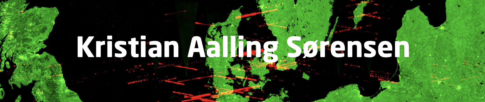
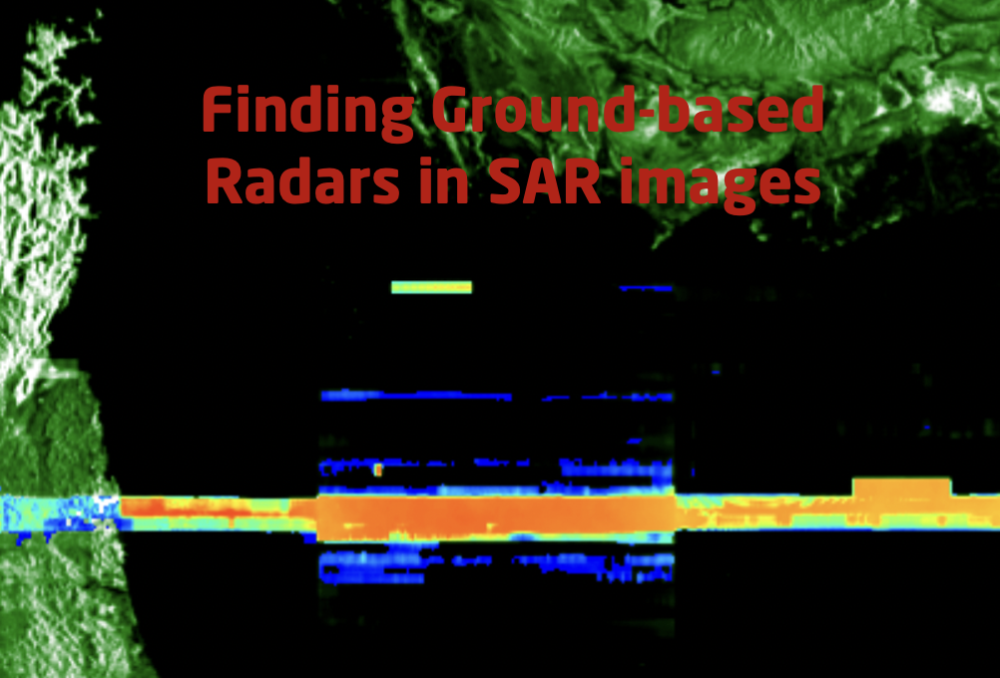
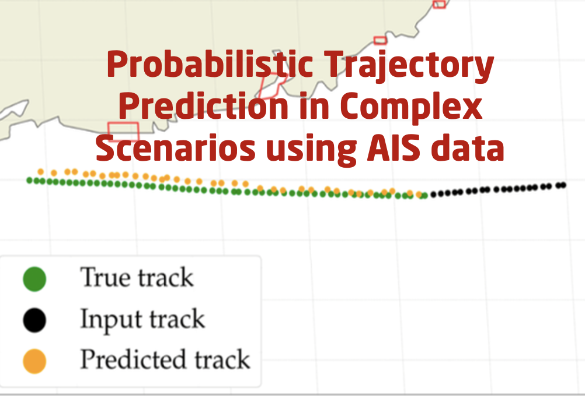
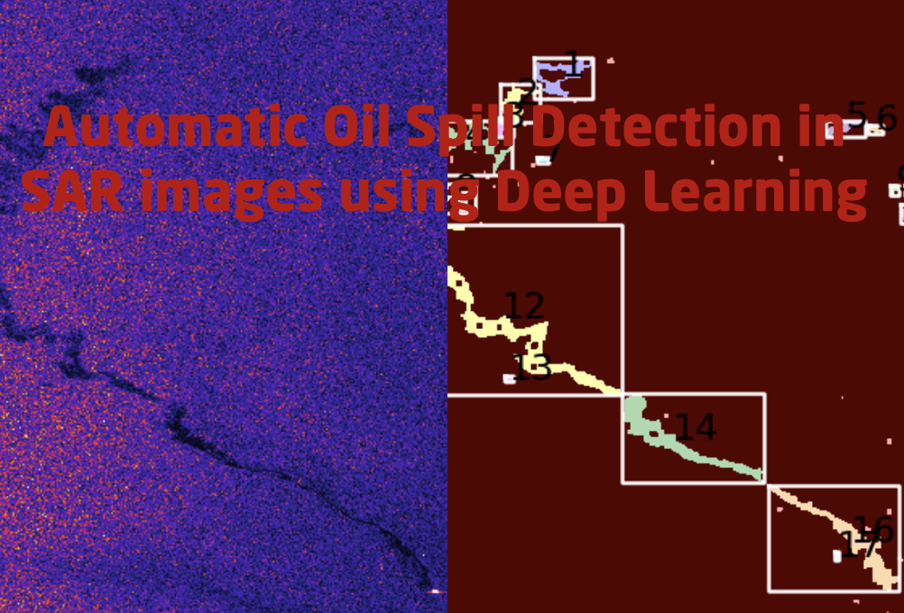
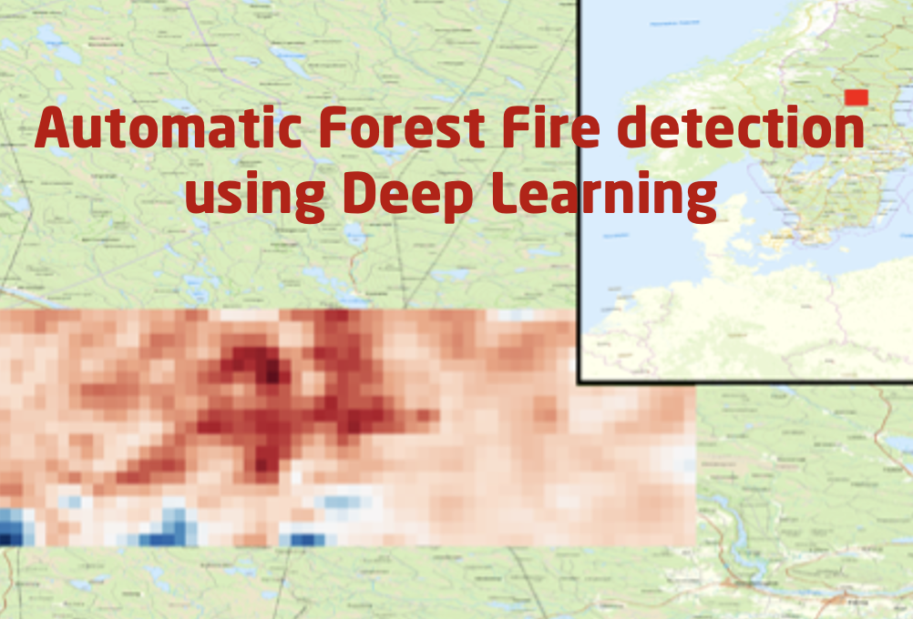
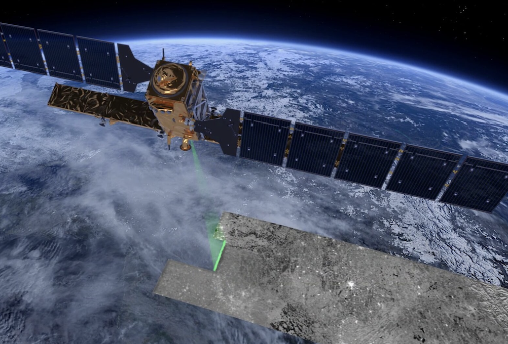
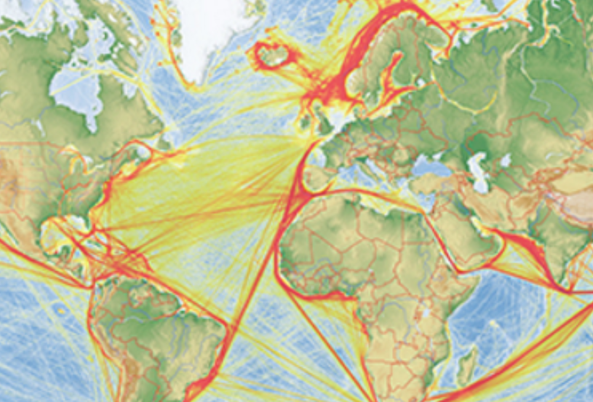

<!--
-->

  

## Hi there 😄

<!--
**aalling93/aalling93** is a ✨ _special_ ✨ repository because its `README.md` (this file) appears on your GitHub profile.

Here are some ideas to get you started:

- 🔭 I’m currently working on ...
- 🌱 I’m currently learning ...
- 👯 I’m looking to collaborate on ...
- 🤔 I’m looking for help with ...
- 💬 Ask me about ...
- 📫 How to reach me: ...
- 😄 Pronouns: ...
- ⚡ Fun fact: ...

### Some projects

|   |  |  |  |
|:---:|:---:|:---:|:---:|
| Radio Frequency Interference in Sentinel-1 SAR iamges | Probibalistic Trajectory Prediction of ships in Complex Scenarios | Automatic Oil Spill Detection | Fire detection |

## Some tools

|   |    |    |    |
|:---:|:---:|:---:|:---:|
| Sentinel-1 SAR in Python. Download data easily (NO LTR!). Process data and stuff | AIS data. Download it and clean it and stuff | Sentinel-2 MSI in Python. Download data and work with it and stuff | Fire detection |

## Something written

|   |    |    |    |
|:---:|:---:|:---:|:---:|
| Sentinel-1 SAR in Python. Download data easily (NO LTR!). Process data and stuff | AIS data. Download it and clean it and stuff | Sentinel-2 MSI in Python. Download data and work with it and stuff | Fire detection |

-->

##  Skills

  

   

